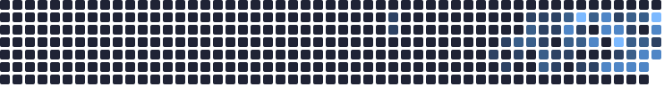
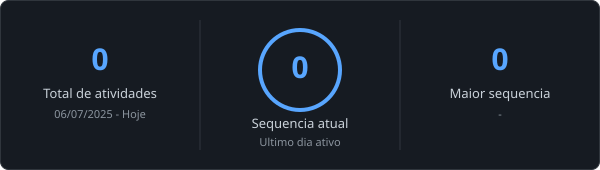

<h1 align="center">Olá, eu sou o João Marcos 👋</h1>

  

  
  

---

## 👨‍💻 Sobre mim
- 🎓 Cursando **Ciência da Computação** na UNESC (2024/1)
- 💼 Desenvolvedor Estagiário na **Betha Sistemas**
- 🚀 Foco atual: Aprofundando conhecimentos no ecossistema **Spring** e construindo aplicações completas

---

## 🌟 Projeto em Destaque

### 💰 [Financial Management](https://github.com/joaomarcosvs/financialManagement-java)
> Após entrar na Betha e começar meu estágio, decidi construir uma aplicação do zero para validar meus conhecimentos de mercado.
> É uma plataforma de gestão financeira com foco em performance e UX. 
> **Stack:** Java, Spring Boot, PostgreSQL, Segurança JWT, AngularJS e Tailwind CSS.

---

## 🛠️ Tecnologias e Ferramentas

  
  
  
  
  
  
  

---

## 📈 Atividade GitLab

  

  Atualizado automaticamente todo dia · clique na imagem pra abrir o SVG e ver a contagem de cada dia ao passar o mouse

  

---

## 📊 Estatísticas do GitHub

  
  

  

---

## 🏆 Trophies

  

---

## 📌 Outros Projetos

  
  

---

## 📫 Contato

  
  
  

